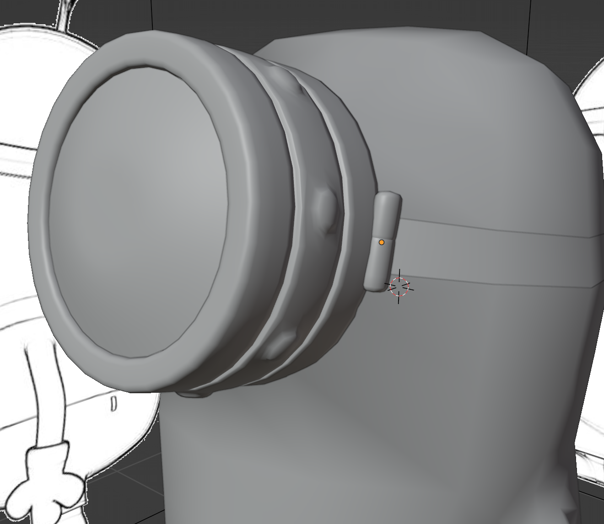
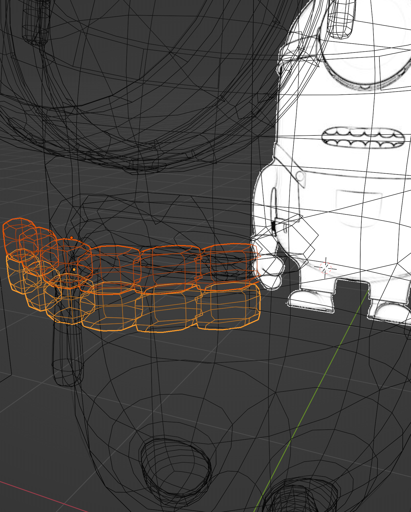
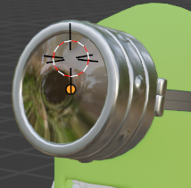

# 3D character _ Minions

#### When it comes to the 3D character modeling, I start with Minions.

### Part 1: 

- New blender file and drop the reference picture into Blender.

- Put the front reference of the character in the front of the graphic view. Just like this: 

- ADD a cube to make the body. 
  Then, [Z] change into Wireframe. Choose the object, in Edit Mode, select the top vertices and change the shape. 
  Modifier Properties, ADD subdivision.  [Command R] to choose Edge Loop.
  Then, in Object Mode, smoothen the cube. 

- Back to Edit Mode after adjusting the position, (WireFrame could select just like X-ray in Solid View)

      

  So, shape it.
  [Alt click] Select Edge Loop and Add-ons LoopTools to get Cycle.

  Choose half of the body and Use Mirror Modifier to make sure that it is symmetrical. (Mirror before Subdivision)

- Make the legs and feet: Press I to make faces. E to extrude and [SZ0] to falt the surface. Then, the arms. Get a little monster.

    

- Make the gloves and shoes so on.        

- This is the first part.

   

### Part 2:

- Get two lines on the head and Duplicate them as a **goggle**. 
  [P] to select them as single object.
  Create a mesh-Cycle, [RZ90] to place it vertically. 
  [EZZ] to extrude. [EescMedianPointS] to create top surface.
  Select the faces and [Alt E] can extrude faces along normals. (towards inside)

  - Create the button: 
    Select the Loop Faces. In select, Checker Deselect, [I] to insert faces and [altE to extrude faces along the normals outside]

  - Create the len of the goggles.
    [EescS] [EescS] [EescS] [F] (in order to later [GZZO] to extrude to the eye)
    Right Click set origin to geometry.

    [SshiftZ] Scale along the X axis.

  

- Create the **mouth** !
  Make a hole and ADD some details.

                

  ​               

- Next, the teeth.
  [command J] to combine all teeth into onr object. Select UpTeeth and LowTeeth and click Control M and Z to choose the Mirror Axis. Last, give teeth one angle.
  

- This is Part 2: 

  

  

### Part 3: The Clothes.

- Front View, Edit Mode, Face Select, [C] to Cycle select. Like this.

   

  And, esc to quit the Cycle Select mode.

- > After shift D to duplicate. Use P to select the object in the object mode.
  >
  > Solidify as next Modifier.

  Object mode, command A to Scale it.

  Mesh is so difficult! To invert them into triangles. (Pocket !)

  M to merge (eight (instead of six) edges to four)

  Ref:                                                                                        My:

      

  So, ......

- **Screws**: UV Sphere. **Shoulder straps:** Plane and [E]

  Srews: 

         

  Then, some details. Get this:

   

- **Eyeball**:

   Shift H to isolate the transformed UV sphere. Biger duplicated UV Sphere could be the Up and Low.

  

- ---

### Part 4: Texturing

- Shade Editor:

  - Glass BSDF: 

    

    

    **Transparent glasses.**

    Screen Space Refraction. ?

    

- UV editor:

  - Except Image Texture, Use Add-on Node Wrangler.
    Pricinpled BSDF and Ctrl T.

    
  
  - How to use unwrap:
  
    Get a Edge Loop and [U] to mark the seam and [A] [U] to unwrap
  
  - Black and White Eyeball; Mix Shader
  
    OK, 
  
    

- Clothing and the Last Result :

  

  
